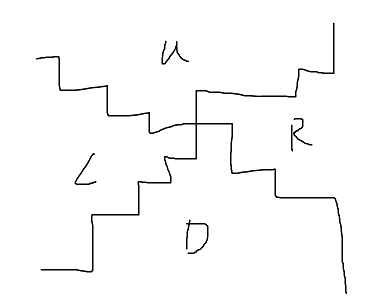

## Round 12

出题人：段昱、魏罗健、郭特

#### 多组数据

如果一开始没有 `WB`，两个人会尽量不接触，判谁苟得长。

如果是 `WB.`，第一个人冲过去就行了。

如果是 `WWBB`，两个人也是尽量不接触。

如果是 `.WBB`，枚举第一步动哪一个 `W`，反正一定是右数第一个或者第二个，递归即可。

#### 多米诺骨牌

显然是每个2x2的里放一块，相当于是在格子里填UDLR，然后U上方全是U，此外还有一些限制，例如R的右下角不能是U和L。可以发现这些限制实际上是限制了一条路径。

随意dp一下即可。

#### 多边形

贴原题跑：https://csacademy.com/contest/round-31/task/balanced-strings

常数问题可以自行解决（

