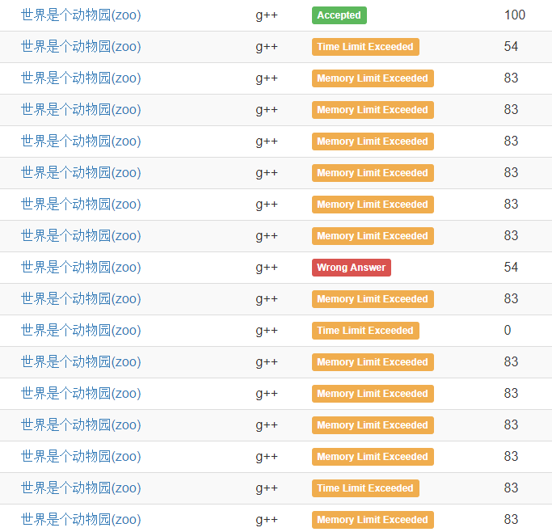
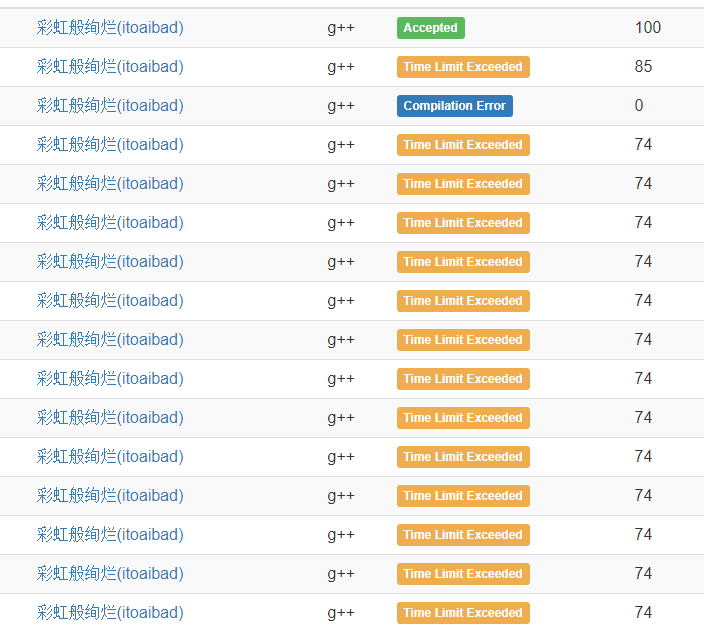

一大早起来看题。土豆怎么又挂了。

看了一遍三个题，前两题看起来都很傻吊。t3好像是个原题改，大概只要能动态维护矩阵秩就行了。

然后打算倒着写。先贴一个t3原题（单组询问），各种 $p,q,s$ 打混之类的沙雕错误调了半年终于过了暴力分，然后写了一会儿就过了。

感觉t1比t2容易写点，就先写t1。t1写了半天终于写对了，交上去MLE83分。认真看了看数据范围居然最后一个包tm空间限制不一样，气死了。经过一番精彩的卡空间终于卡了进去。

然后写t2，调了半天终于写对了，然后过了3.5s的那个包，2.5s的没过，然后开始疯狂卡常数，卡了半年终于卡过去了。

另外有个小道消息，t3的强制在线不大靠谱，直接预处理出所有答案然后看哪个答案和输入比较接近输出哪个就能过强制在线的分（

-----

t1和t3还是挺有意思的，t2感觉（我的垃圾做法）比较一眼。卡空间大概是为了强行区分做法，卡常数就不知道了（