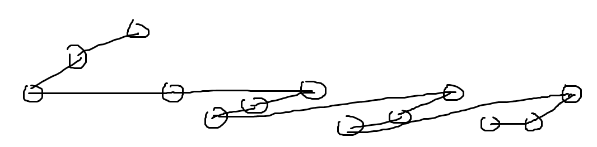

## Round 7

出题人：王泽州、袁浩天、张一玎

#### Visit

容易观察出答案路径长这样：

就是一个后缀经过两次，之前再找一些网友经过三次。随便维护即可。

#### Pigeon

设 x 和 y 分到的任务分别为 $(a_1,b_1),(a_2,b_2)...(a_p,b_p)$ 和 $(c_1,d_1),(c_2,d_2)...(c_q,d_q)$，如果 x 鸽了，那么显然是 x 做完了自己的任务，然后做完了 y 已经做完的任务，那就是 $\sum_{i=1}^p a_i+\sum_{i=1}^{t-1}c_i <\sum_{i=1}^t d_i$。显然 x 和 y 不能都鸽，所以可以分别计算。dp的话只要记前若干个，这个值（自己这个c也记上去）为啥，历史最小值为啥就好了。meet in the middle也可以，大概合并的时候是搞个二维前缀和。

#### Subsequence

首先子序列这个结构可以用矩阵乘法维护（我代码写的比较神奇，小问题），然后考虑进行数位dp，就只要考虑 $i$ 位的数序列长啥样，它显然可以由 $i-1$ 位的数序列 shift 上 $0,1...k-1$ 拼接而成。shift和拼接这个东西可以倍增。数位dp的时候也可以用这个倍增。