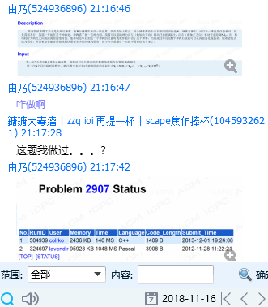

一大早起来看题，评测机不出意外叕土豆了。

~~感觉隔一两天写都忘的差不多了，还是要当天写~~

出门看t1，Claris泄题石锤。~~不过好像也挺傻逼的~~

然后看t2，看了一会儿看懂题了，列了个式子，然后立刻得到了一个优秀poly做法，数了一下好像复杂度有点恐怖（其实好像是多加了几维），然后发现 $n \leq 47$，上去安排了个meet-in-the-middle就赢了。

看t3，目测了一下建个自动机就poly了，然后想了想细节。首先明显是可以shift，但是四方log还是有点高。认真看了看发现转移那个暴力shift好像可以倍增，然后就过了。

-----

感觉是比较正常的noi模拟赛难度？题目质量还是很不错的。